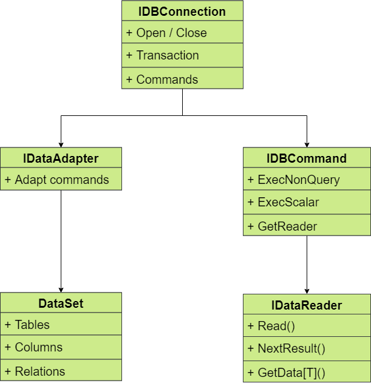

# Лекция №4
 - # Объектное представление БД
   - Схема DDL
   - Данные DML
   - Контроль DCL
   - Транзакции TCL
 - # ADO.NET (activex data object .net)
   - Интерфейсы доступа к данным (OLE DB, ODBC)
   - Источники данных  
 - # System.Data - [ADO.NET](#add1)   
   - Data Mapper ([Dapper](#add2))   
 - # Шаблоны доступа к данным
   - Repository ([Схема](#add3))   
   - Unit of work ([Схема](#add4))   
 - # Active Record
   - Точка зрения ООП
   - Точка зрения функционального подхода
   - ([Пример реализации](#add5)) 
 
# Задание №4
 - Сделать запрос в БД через ADO.NET
 - Как бы могла выглядеть реализация Data Mapper?
 - В каких случаях использовать шаблон Repository а в каком Unit of Work?
 - Будете ли вы использовать Active Record?
 - Реализовать пользователя через ORM
 
# Доп. материалы №1<a name="add1"></a>



# Доп. материалы №2<a name="add2"></a>
 - Model
````C#
public class Dog
{
    public int? Age { get; set; }
    public Guid Id { get; set; }
    public string Name { get; set; }
    public float? Weight { get; set; }

    public int IgnoredProperty { get { return 1; } }
}
````
 - Data Mapper
````C#
var dog = connection.Query<Dog>("select Age = @Age, Id = @Id", new { Age = (int?)null, Id = Guid.NewGuid(); });
````
 - Attribute mapping (System.Data.Linq.Data.Mapping)
````C#
[Table("db_dogs")]
public class Dog
{
    [Column("c_age")]
    public int? Age { get; set; }
    
    [Column("c_id")]
    [Key]
    public Guid Id { get; set; }
    
    
    [Column("c_name")]
    public string Name { get; set; }
    
    [Column("c_weight")]
    [Meta(typeof(int))]
    public float? Weight { get; set; }

    public int IgnoredProperty { get { return 1; } }  
}
````
 - Fluent mapping
````C#
//functional mapping example
db.Table<Dog>("db_dogs")
  .Column("c_age",x=>x.Age)
  .Column("c_id",x=>x.Id)
    .AsFK();
  .Column("c_name",x=>x.Name)
  .Column("c_weight",x=>x.Weight)
    .AsType<int>();
````

# Доп материалы №3<a name="add3"></a>


# Доп материалы №4<a name="add4"></a>


# Доп материалы №5<a name="add5></a>
````C#
public abstract class ActiveRecord<T> where T: EntityWithId, class, new()
{
    protected T PersistentProvider;
    public ActiveRecord(T injectedPersistentProvider)
    {
       this.PersistentProvider=injectedPersistentProvider;
    }
 
    protected virtual T Create<T>() 
    {
       var entity = new T();
       
       var newId=this.PersistentProvider.GetId(typeof(T));
       entity.Id=newId;
       
       return entity;
    }
}
````
